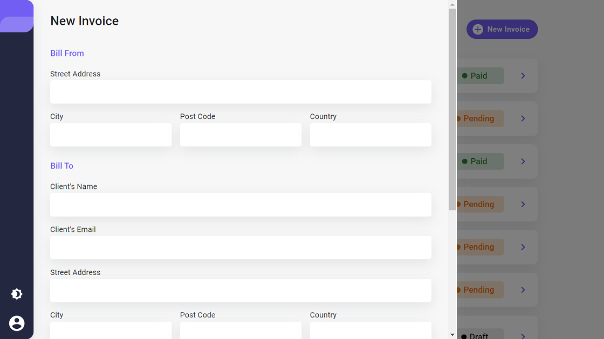

# Invoice App

## Overview

I started this project with the intention of taking a design and trying to replicate it with the help of react and material ui frameworks.

## Requirements

- Users should be able to interact with a list of invoices, create, edit and delete them.
- The browser's localStorage wil be constantly synchronized with the state of the app to allow data persistence.
- Forms will have data validation before performing the critical actions. Formik and yup packages were used for this.
- Filter invoices by status (draft/pending/paid)
- Toggle light and dark mode

## Final comments

Good and bad things emerged during the building process. Among the good ones, it helped me a lot on the use of context api for small slices of state. Formik also helped me with conmon form validation logic. 
I had some problems with material ui, this package performs a major update in the middle of building the app. Besides this, it took me a little longer than it should have to try to customize the original components of material ui to achieve the requirements. 
Maybe it would have been better to use classic css with styled components

Credits to frontend mentor. I got the idea from these guys